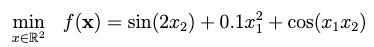
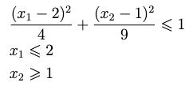

# Parallel and Distributed Programming project

The task was to find minimal solution for the following equation:

With restrictions set on `x1` and `x2`:

The homework consisted of solving the problem in following ways:
1. Sequentially (C++ 11, gcc 13)
2. Parallelizing the sequential solution using OpenMP (version 16.0.4)
3. Using multithreading (C++ 11, gcc 13)
4. Using Open MPI (version 4.1.5)
5. Using some form of distributed computing without shared memory - gRPC with C#, .NET 7

Each solution is in a separate folder and contains a `run.sh` bash script to run each solution. There are some disclaimers concerning them:: 
- Run each script in terminal in the same location as the script. 
- Don't run Open MPI script as root - Open MPI does not recommend it.
- The script for gRPC solution will build projects and create 8 instances of the gRPC server that will use ports 5550-5557. They are not killed after the script has been run so may have to kill them yourself or just simply leave them running - they don't consume many resources and won't start if you restart your PC. Mind that on rerun these services will fail since the port will already be taken. You will probably need to run this script as root - if you don't your terminal may freeze when the server tries to start up.